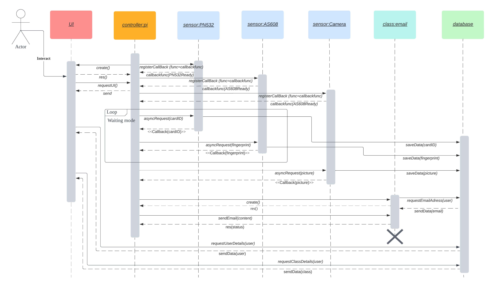
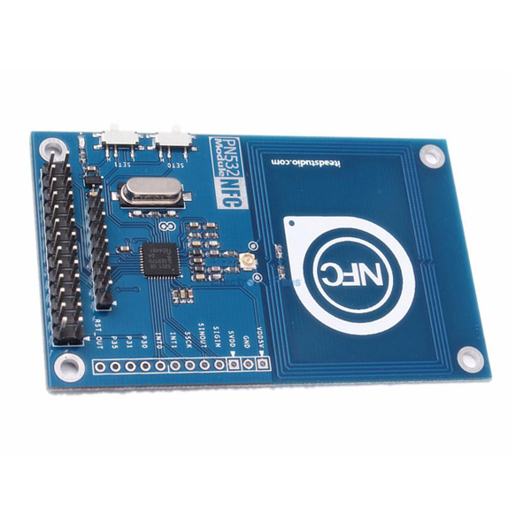
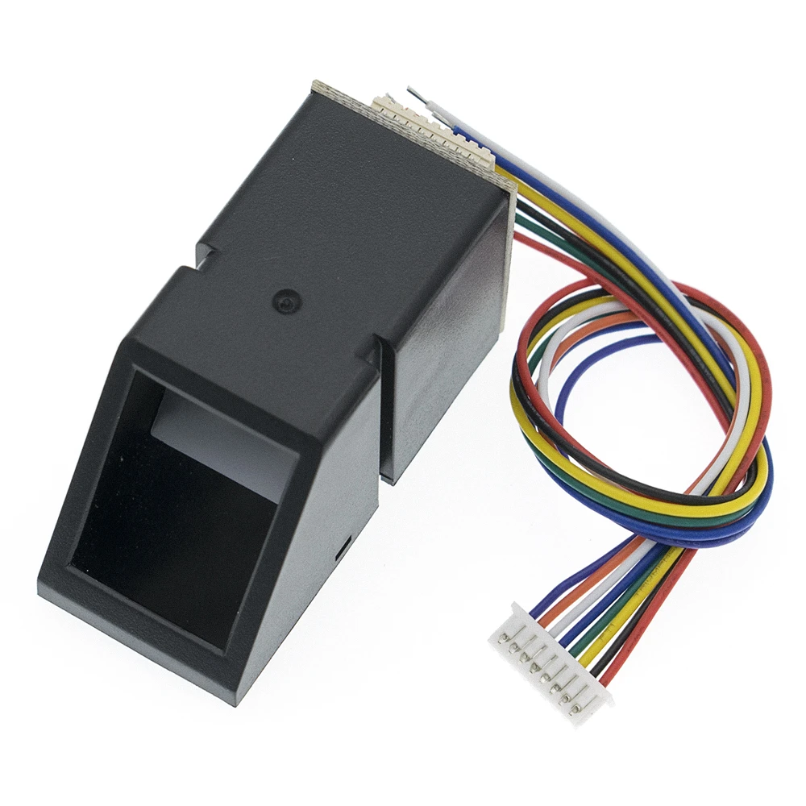
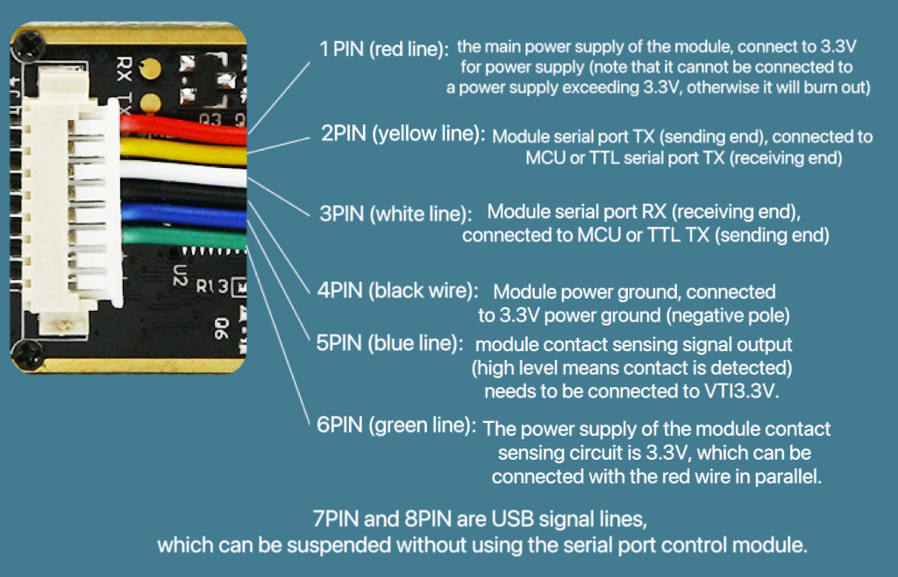
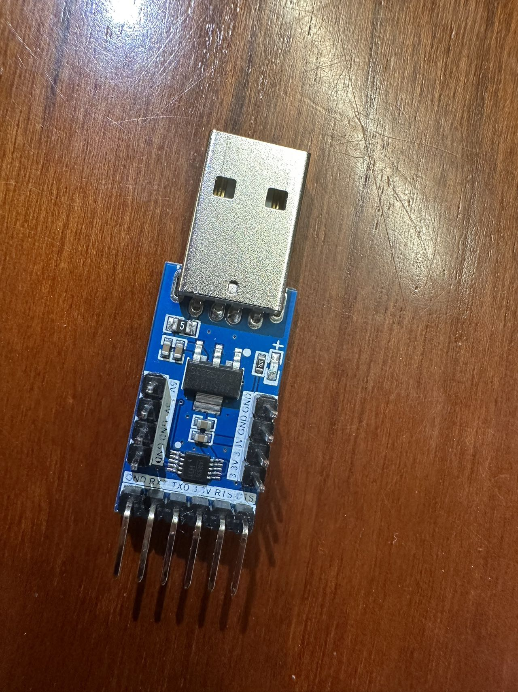
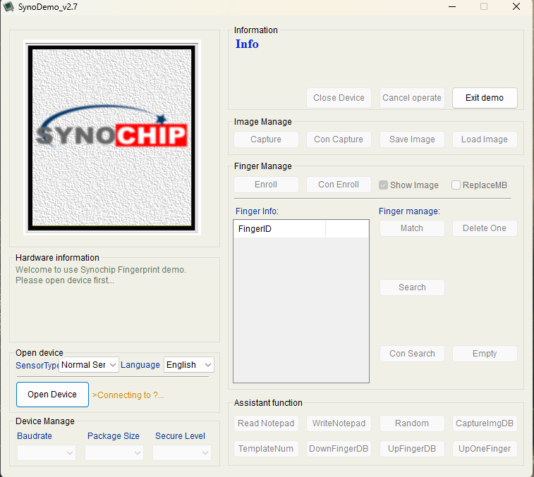

<h1> PunchIN - A Smart Attendance Recording System </h1>
<br>

<p align="center">
    
</p>


<h2> About the Project </h2>
Tired of taking attendance by hand? This project will surely help you out! PunchIN is a real-time raspberry Pi project which aims to simplify the process of taking attendance by introducing a smart device. It not only saves time but also ensures accuracy and reduces the chance of manual errors. This system eliminates the need for manual signatures and allows students to mark their attendance in just a few seconds.
<br>
<br>

<h2> Join us on social media </h2>

<a href="https://twitter.com/PunchIN_38">
  
</a>

<a href="https://www.youtube.com/channel/UC1_89wKcrga4XP-w_oYpf4w">
  
</a>

<br>

<h2> <br> Features </h2>

<h3> 1. Take attendance with two methods </h3>

* RFID / NFC
* Fingerprint


<br>

<h3> 2. Friendly UI design </h3>

Intuitive UI design with three operation modes:

- Attendance Taking mode
- User Registration mode 
- Class Scheduling mode

<br>

<h3> 3. Email notification </h3>

- A confirmation email will be sent out automatically when a student has punched in
- A reminder email will be sent to students who registered in a class but did not show up on time

<br>

<h3> 4. Real-time attendance record </h3>

All scheduled classes and attendance records are saved into the local database. Course instructors can review the real-time attendance record in the front panel at any time.

<br>

<h2> Maximum Flexibility! </h2>

<br>

<h2> Hardware </h2>

1. Raspberry Pi 4B 2G (Microprocessor)
2. 7" 800*480 TN Touch Monitor (Front panel)
3. PN532 RFID/NFC Reader (Sensor)
4. AS608 Optical Fingerprint Sensor (Sensor)

<br>

<h2> System Design </h2>

1. Circuit Diagram


<br>
<br>

2. Sequence Diagram


<br>

<br>
<br>

<h2> Getting Started </h2>


<h3> Hardware </h3>
<h4> Prerequisites </h4>

1. RFID/NFC-PN532
<br>

<br>

2. Fingerprint-AS608
<br>

<br>
<h4> Installation </h4>

1. RFID/NFC-PN532
<br>
We follow the steps of connection to connect our PN532 NFC module to the Raspberry Pi 4B: 
[Steps of connecting PN532 module to a Raspberry Pi](https://littlebirdelectronics.com.au/guides/181/nfc-module-with-raspberry-pi)
<br>
The exact pin definition of Raspberry Pi 4B can be seen in the reference.
<br>

2. Fingerprint-AS608
<br>
We find a pin definition for our AS608 module, when connecting to a Raspberry, we only use pin 1-6, in our attendence project, we define pin5 of AS608 connect to GPIO 1(Use WiringPi definition here) of Raspberry Pi.
<br>

<br>
Using a fingerprint test software SYDemo to verify every function in the AS608 module, such as adding fingerprint, deleting finerprints and list all fingerprint index. 
<br>
It need a TTL-USB converter to make communication between AS608 and PC possibile.
<br>

<br>
When open device, COM number should be choosen, we can check the  "Windows Device Console" to confirm the COM number of TTL-USB, and open device with this COM number.
<br>



<br>

<h3> Software </h3>
<h4> Prerequisites </h4>

1. E-mail

<br>

2. Database
<br>

```
sudo apt-get install sqlite3 libsqlite3-dev
```


3. UI
<br>

## Required packages

Install the QT5 and Qwt development packages:

```
    sudo apt-get install qtdeclarative5-dev-tools
    sudo apt-get install libqwt-qt5-dev
    sudo apt-get install qtbase5-dev
```


4. GPIO
<br>
Check if WiringPi installed in Raspberry Pi

```
    gpio -v // output information about wiringpi in terminal
```

<br>
Install WiringPi
<br>

```
    sudo apt-get install wiringpi
```
<br>
<h4> Installation </h4>

## Building the project

```
    mkdir build && cd build
    cmake ..
    make
```

## Running the project

```
    ./punchin
```

<br>

<h2> Contributors </h2>
<a href="https://github.com/lkobnas/Attendance-recording-system/graphs/contributors">
  
</a>

<br>

([lkobnas](https://github.com/lkobnas)) - San Bok Lam (2426734L) <br>
([37Sniper](https://github.com/37Sniper)) - Chenguang Wang (2826966W) <br>
([HengyuY](https://github.com/HengyuY)) - Hengyu Yang (2822511Y) <br>
([Yyyyy0512](https://github.com/Yyyyy0512)) - Jin Yang (2803454Y) <br>
<br>
<br>

<h2> Test </h2>

<br>

<h2> Project Planning </h2>

[GitHub Projects - PunchIN Project Planning](https://github.com/users/lkobnas/projects/1)
<br>
<br>

<h2> References </h2>

GPIO Pinout of Raspberry Pi 4B (2G)
<br>


<br>
A PN532 library, which gives PN532 libraries for Rspberry Pi, STM32 and Arduino.

[PN532-library](https://github.com/soonuse/pn532-lib)
<br>
A AS608 library writen by C, while most library of AS608 are writen by Python.

[AS608-library](https://github.com/soonuse/pn532-lib)
<br>
SQLite: A lightweight embedded relational database management system, which is written in the C language.

[SQLite](https://sqlite.org/index.html)
<br>
SendGrid: A cloud-based email delivery platform that provides a simple, reliable, and efficient way to send and manage emails.

[SendGrid](https://sendgrid.com/)
<br>


<h2> Acknowledgements </h2>

* Logo Design and Inspiration  ([Wix](https://www.wix.com/logo/maker))
* Creating Icon ([Flaticon](https://www.flaticon.com/))
* Making contributor section ([contributor.img](https://contrib.rocks/))
* Creating graph and diagram ([Lucidchart](https://www.lucidchart.com/pages/))


<!-- MARKDOWN LINKS & IMAGES -->


