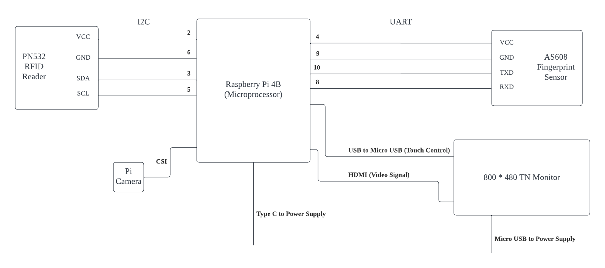

<h1> PunchIN - A Smart Attendance Recording System </h1>
 

    

<h2> About the Project </h2>
Tired of taking attendance by hand? This project will surely help you out! PunchIN is a real-time raspberry Pi project which aims to simplify the process of taking attendance by introducing a smart device. It not only saves time but also ensures accuracy and reduces the chance of manual errors. This system eliminates the need for manual signatures and allows students to mark their attendance in just a few seconds.
 
 

<h2> Join us on social media </h2>
 

 
 

<h2> Features </h2>

<h3> 1. Take attendance with three methods

* RFID / NFC
* Facial recognition
* Fingerprint

Maximum Flexibility!

 

<h3> 2. Friendly UI design </h3>

Intuitive UI design with three operation modes:

- Attendance Taking mode
- User Registration mode 
- Class Scheduling mode

 

<h3> 3. Email notification </h3>

- A confirmation email will be sent out automatically when a student has punched in
- A reminder email will be sent to students who registered in a class but did not show up on time

 

<h3> 4. Real-time attendance record </h3>

All scheduled classes and attendance records are saved into the local database. Course instructors can review the real-time attendance record in the front panel at any time.

 

<h2> Hardware </h2>

1. Raspberry Pi 4B 2G (Microprocessor)
2. 7" 800*480 TN Touch Monitor (Front panel)
3. PN532 RFID/NFC Reader (Sensor)
4. 90 degrees Camera (Sensor)
5. AS608 Optical Fingerprint Sensor (Sensor)

 

<h2> System Design </h2>

 

<h2> Circuit Diagram </h2>

 

 
 

<h2> Getting Started </h2>

<h3> Prerequisites </h3>
 

<h3> Installation </h3>
 

 

<h2> Usage </h2>
 

<h2> References </h2>

GPIO Pinout of Raspberry Pi 4B (2G)
 

 
 

<h2> Acknowledgements </h2>
* Wix  ([Logo Design and Inspiration](https://www.wix.com/logo/maker))
* Flaticon  ([Icon](https://www.flaticon.com/))

<!-- MARKDOWN LINKS & IMAGES -->

