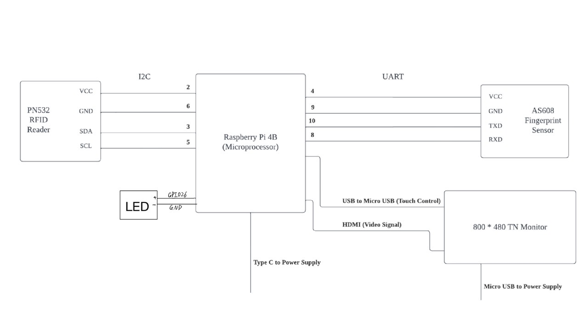

<h1> PunchIN - A Smart Attendance Recording System </h1>
<br>

<p align="center">
    
</p>


<h2> About the Project </h2>
Tired of taking attendance by hand? This project will surely help you out! PunchIN is a real-time raspberry Pi project which aims to simplify the process of taking attendance by introducing a smart device. It not only saves time but also ensures accuracy and reduces the chance of manual errors. This system eliminates the need for manual signatures and allows students to mark their attendance in just a few seconds.
<br>
<br>

<h2> Join us on social media </h2>

<a href="https://twitter.com/PunchIN_38">
  
</a>

<a href="https://www.youtube.com/channel/UC1_89wKcrga4XP-w_oYpf4w">
  
</a>

<br>

<h2> <br> Table of content </h2>
<ul>
  <li><a href="#features">Features</a></li>
  <li><a href="#required-hardware">Required Hardware</a></li>
  <li><a href="#system-design">System Design</a></li>
  <li><a href="#getting-started">Getting Started!</a></li>
  <li><a href="#test">Test</a></li>
  <li><a href="#project-planning">Project Planning</a></li>
  <li><a href="#contributors">Contributors</a></li>
  <li><a href="#references">References</a></li>
  <li><a href="#acknowledgements">Acknowledgements</a></li>
</ul>


<h2 id="features"> <br> Features </h2>

<h3> 1. Take attendance with two methods </h3>

* RFID / NFC
* Fingerprint


<br>

<h3> 2. Friendly UI design </h3>

Intuitive UI design with various features:

- Attendance Taking
- Add Student to PunchIN
- Add Course to PunchIN
- Administrative Mode
- Real-time Course Table
- Expecting and Arrived student table

<br>

<h3> 3. Email notification </h3>

- Confirmation email will be sent to new registered student
- Confirmation email will be sent to student who has been enrolled to a new course
- Confirmation email will be sent out automatically when a student has punched in
- Reminder email will be sent to students who registered in a class but did not show up on time

<br>

<h3> 4. Real-time attendance record </h3>

All scheduled classes and attendance records are saved into the local database. Course instructors can review the real-time attendance record in the front panel at any time.

<br>

<h3> 5. Doorlock control </h3>

A doorlock will be opened for student who has just Punched in. In this project, we will use a LED to simulate the door unlocking process.
We originally intended to use GPIO to control the door lock, but the output power of the GPIO was not sufficient to drive the door lock to open. Therefore, we modified the high-level duration of GPIO26 according to the power-on time required by the door lock. When the LED light turns on, it means that the door lock has been opened. If we need to control the door lock using GPIO, a feasible solution is to use a relay to control whether the door lock is powered on. The current value output by the GPIO port of the Raspberry Pi can meet the condition for opening the relay, so we can use GPIO to control the relay and thus control the door lock. From a code perspective, we only need to control the high-level duration of the GPIO port, so there is basically no difference in code implementation.

<br>

<b> Maximum Flexibility! </b>

<br>

<h2 id="required-hardware"> Required Hardware </h2>

1. Raspberry Pi 4B 2G (Microprocessor)
2. 7" 800*480 TN Touch Monitor (Front panel)
3. PN532 RFID/NFC Reader (Sensor)
4. AS608 Optical Fingerprint Sensor (Sensor)

<br>

<h2 id="system-design"> System Design </h2>

1. Circuit Diagram


<br>
<br>

2. Sequence Diagram


<br>

<br>
<br>

<h2 id="getting-started"> Getting Started </h2>
<h3><b> Hardware </b></h3>
<h3> Prerequisites </h3>
<br>
1. RFID/NFC-PN532
<br>

<br>
2. Fingerprint-AS608
<br>

<br>
<br>
<br>

<h3> Installation </h3>
<br>
1. RFID/NFC-PN532
<br>
We follow the steps of connection to connect our PN532 NFC module to the Raspberry Pi 4B: 
[Steps of connecting PN532 module to a Raspberry Pi](https://littlebirdelectronics.com.au/guides/181/nfc-module-with-raspberry-pi)
<br>
The exact pin definition of Raspberry Pi 4B can be seen in the reference.
<br>
2. Fingerprint-AS608
<br>

We find a pin definition for our AS608 module, when connecting to a Raspberry, we only use pin 1-6, in our attendence project, we define pin5 of AS608 connect to GPIO 1(Use WiringPi definition here) of Raspberry Pi.

<br>

<br>

Using a fingerprint test software SYDemo to verify every function in the AS608 module, such as adding fingerprint, deleting finerprints and list all fingerprint index. 
<br>

It need a TTL-USB converter to make communication between AS608 and PC possibile.

<br>

<br>

When open device, COM number should be choosen, we can check the  "Windows Device Console" to confirm the COM number of TTL-USB, and open device with this COM number.

<br>


<br>
<br>
3. Doorlock/LED
<br>
Connect the LED positive pin to RaspberryPi GPIO pin 26, LED negative pin to Raspberry Pi Ground pin.

<br>
<h3><b> Software </b></h3>
<h3> Prerequisites </h3>
<br>
1. E-mail

<br>
Download curl library 

```
sudo apt-get install curl.
```

<br>
* Create a SendGrid account and get an API key
<br>
Go to the SendGrid website at https://sendgrid.com/.
<br>
Click on the "Sign Up" button located in the top-right corner of the website.
<br>
Fill in your email address, password, and complete the reCAPTCHA to create an account.
<br>
Once you have created an account, log in to the SendGrid dashboard.
<br>
In the dashboard, click on the "Settings" button in the left-hand navigation menu.
<br>
Select "API Keys" from the list of options.
<br>
Click on the "Create API Key" button.
<br>
Give your API key a name, select the permissions you want to grant it, and click on the "Create & View" button.
<br>
Your new API key will now be displayed on the screen. Make sure to copy and securely store the API key somewhere safe, as it will only be displayed once.
<br>
<br>
2. Database

<br>

```
sudo apt-get install sqlite3 libsqlite3-dev
```

<br>
3. UI

<br>

Install the QT5 and Qwt development packages:

```
    sudo apt-get install qtdeclarative5-dev-tools
    sudo apt-get install libqwt-qt5-dev
    sudo apt-get install qtbase5-dev
```

<br>
4. GPIO
<br>

Check if WiringPi installed in Raspberry Pi

```
    gpio -v // output information about wiringpi in terminal
```

<br>
5. Install wiringPi
<br>

```
    sudo apt-get install wiringpi
```
<br>
6. Cmake
<br>

```
    sudo apt-get install cmake
```
<br>
<br>
<h3> Installation </h3>
<br>
Clone PunchIN here!

```
git clone https://github.com/lkobnas/Attendance-recording-system.git
```
<br>
Create build folder

```
cd Attendance-recording-system/src
mkdir build && cd build
```
<br>
Create E-mail credentials file inside the build folder

```
    touch credentials.txt
```
Then copy the API key we got and paste it into the "credentials.txt", make sure the API key in the first row of txt file.

<br>
Building the project

```
    cmake ..
    make
```
<br>
Running the project

```
    ./punchin
```

<br>


<h2 id="test"> Test </h2>
We are using Google Test in the project. Click the following link for more details!

([Testing Page](./Test)) <br>
<br>
<br>

<h2 id="project-planning"> Project Planning </h2>

[GitHub Projects - PunchIN Project Planning](https://github.com/users/lkobnas/projects/1)
<br>
<br>


<h2 id="contributors"> Contributors </h2>
<a href="https://github.com/lkobnas/Attendance-recording-system/graphs/contributors">
  
</a>

<br>

([lkobnas](https://github.com/lkobnas)) - San Bok Lam (2426734L) <br>
([37Sniper](https://github.com/37Sniper)) - Chenguang Wang (2826966W) <br>
([HengyuY](https://github.com/HengyuY)) - Hengyu Yang (2822511Y) <br>
([Yyyyy0512](https://github.com/Yyyyy0512)) - Jin Yang (2803454Y) <br>
<br>
<br>

<h2 id="references"> References </h2>

GPIO Pinout of Raspberry Pi 4B (2G)
<br>


<br>
A PN532 library, which gives PN532 libraries for Rspberry Pi, STM32 and Arduino.

[PN532-library](https://github.com/soonuse/pn532-lib)
<br>

A AS608 library writen by C, while most library of AS608 are writen by Python.

[AS608-library](https://github.com/soonuse/pn532-lib)
<br>
SQLite: A lightweight embedded relational database management system, which is written in the C language.

[SQLite](https://sqlite.org/index.html)
<br>
SendGrid: A cloud-based email delivery platform that provides a simple, reliable, and efficient way to send and manage emails.

[SendGrid](https://sendgrid.com/)
<br>


<h2 id="acknowledgements"> Acknowledgements </h2>

* Logo Design and Inspiration  ([Wix](https://www.wix.com/logo/maker))
* Creating Icon ([Flaticon](https://www.flaticon.com/))
* Making contributor section ([contributor.img](https://contrib.rocks/))
* Creating graph and diagram ([Lucidchart](https://www.lucidchart.com/pages/))

<br>
<br>


<!-- MARKDOWN LINKS & IMAGES -->


